<div align="center">

# 🏍️ GeoSense

**Transforme seu pátio em um espaço inteligente, seguro e eficiente**

[](https://www.oracle.com/java/)
[](https://spring.io/projects/spring-boot)
[](https://www.oracle.com/database/)
[](https://maven.apache.org/)

> 🚀 **Sistema inteligente de gestão de pátios para oficinas mecânicas**  
> Transforme seu espaço de trabalho em um ambiente organizado, eficiente e totalmente digital

[](https://geosense-sprint3-1.onrender.com)
[](https://github.com/geosense/geosense/releases)
[](README.md)
[](LICENSE)

---

## 📋 Índice

[🎯 Sobre o Projeto](#-sobre-o-projeto) • [🏗️ Arquitetura](#️-arquitetura-do-sistema) • [⚙️ Funcionalidades](#️-funcionalidades) • [🚀 Instalação](#-instalação-e-execução) • [🌐 Deploy](#-deploy-e-configuração) • [📱 Acesso](#-acesso-à-aplicação) • [🧪 Testes](#-testes)

---

</div>

## 🎯 Sobre o Projeto

<div align="center">

> 🚀 **GeoSense** é uma aplicação web desenvolvida em Spring Boot que **revoluciona a gestão de pátios** para oficinas mecânicas. O sistema oferece controle inteligente de vagas, alocação de motocicletas, gestão de usuários e rastreamento completo do histórico de serviços.

</div>

### 🎯 Objetivos Principais

|               🎯 **Gestão Inteligente**               |               🔒 **Segurança**                |              ⚡ **Eficiência**              |            📊 **Rastreabilidade**             |
| :---------------------------------------------------: | :-------------------------------------------: | :-----------------------------------------: | :-------------------------------------------: |
| Controle automatizado de vagas e alocação de veículos | Sistema de autenticação e autorização robusto | Otimização do fluxo de trabalho em oficinas | Histórico completo de alocações e manutenções |

---

## 👥 Equipe de Desenvolvimento

<div align="center">

| **Rafael de Souza Pinto** | **Luis Paulo Freitas Fernandes** | **Enzo Marsola** |
| :-----------------------: | :------------------------------: | :--------------: |
|         RM 555130         |            RM 555497             |    RM 556310     |

</div>

---

## 🏗️ Arquitetura do Sistema

### 🛠️ Stack Tecnológico

<div align="center">

|                                                        **Backend**                                                        |                                             **Frontend**                                             |                                        **Database**                                        |                                                  **Tools**                                                  |
| :-----------------------------------------------------------------------------------------------------------------------: | :--------------------------------------------------------------------------------------------------: | :----------------------------------------------------------------------------------------: | :---------------------------------------------------------------------------------------------------------: |
|                                           |       |       |                    |
|            |      |  |  |
|  |  |                                                                                            |                              |
|         |                                                                                                      |                                                                                            |                                                                                                             |

</div>

### 🏛️ Padrões Arquiteturais

<div align="center">

|              🎨 **MVC**              |           🗃️ **Repository**           |                 📦 **DTO**                  |      ⚙️ **Service Layer**      |
| :----------------------------------: | :-----------------------------------: | :-----------------------------------------: | :----------------------------: |
| Separação clara de responsabilidades | Abstração da camada de acesso a dados | Transferência segura de dados entre camadas | Lógica de negócio centralizada |

</div>

### 📁 Estrutura do Projeto

```mermaid
graph TD
    A[📁 geosense/Geosense] --> B[⚙️ config/]
    A --> C[🎮 controller/]
    A --> D[📦 dto/]
    A --> E[🗃️ entity/]
    A --> F[💾 repository/]
    A --> G[🔧 service/]
    A --> H[🔒 security/]
    A --> I[✅ validation/]

    B --> B1[AdminInitializer.java]
    B --> B2[FlywayConfig.java]
    B --> B3[SecurityConfig.java]

    C --> C1[AdminApiController.java]
    C --> C2[AlocacaoMotoController.java]
    C --> C3[AuthController.java]
    C --> C4[HomeController.java]
    C --> C5[MotoController.java]
    C --> C6[PatioController.java]
    C --> C7[UsuarioController.java]

    D --> D1[AlocacaoMotoDTO.java]
    D --> D2[CredentialsDTO.java]
    D --> D3[MotoDTO.java]
    D --> D4[UsuarioDTO.java]

    E --> E1[Usuario.java]
    E --> E2[Moto.java]
    E --> E3[Patio.java]
    E --> E4[Vaga.java]
    E --> E5[AlocacaoMoto.java]
    E --> E6[Defeito.java]

    F --> F1[UsuarioRepository.java]
    F --> F2[MotoRepository.java]
    F --> F3[PatioRepository.java]
    F --> F4[AlocacaoMotoRepository.java]

    G --> G1[UsuarioService.java]
    G --> G2[MotoService.java]
    G --> G3[PatioService.java]
    G --> G4[AlocacaoMotoService.java]

    H --> H1[CustomUserDetails.java]
    H --> H2[CustomUserDetailsService.java]
    H --> H3[PasswordEncoderConfig.java]

    I --> I1[SenhaValidator.java]
    I --> I2[ProblemaValidator.java]
    I --> I3[EmailValidator.java]
    I --> I4[UsuarioValidator.java]
    I --> I5[SpringContextHelper.java]
```



<details>
<summary>📋 <strong>Ver estrutura completa do projeto</strong></summary>

```
src/main/java/geosense/Geosense/
├── ⚙️ config/                 # Configurações da aplicação
│   ├── AdminInitializer.java
│   ├── FlywayConfig.java
│   └── SecurityConfig.java
├── 🎮 controller/             # Controladores REST/Web
│   ├── AdminApiController.java
│   ├── AlocacaoMotoController.java
│   ├── AuthController.java
│   ├── HomeController.java
│   ├── MotoController.java
│   ├── PatioController.java
│   └── UsuarioController.java
├── 📦 dto/                    # Data Transfer Objects
│   ├── AlocacaoMotoDTO.java
│   ├── CredentialsDTO.java
│   ├── DefeitoDTO.java
│   ├── MotoDTO.java
│   ├── PatioDTO.java
│   ├── UsuarioDTO.java
│   └── ...
├── 🗃️ entity/                 # Entidades JPA
│   ├── Usuario.java
│   ├── Moto.java
│   ├── Patio.java
│   ├── Vaga.java
│   ├── AlocacaoMoto.java
│   ├── Defeito.java
│   └── ...
├── 💾 repository/             # Repositórios de dados
│   ├── UsuarioRepository.java
│   ├── MotoRepository.java
│   ├── PatioRepository.java
│   └── ...
├── 🔧 service/                # Serviços de negócio
│   ├── UsuarioService.java
│   ├── MotoService.java
│   ├── PatioService.java
│   ├── ValidacaoOracleService.java
│   └── ...
├── 🔒 security/               # Configurações de segurança
│   ├── CustomUserDetails.java
│   ├── CustomUserDetailsService.java
│   └── PasswordEncoderConfig.java
└── ✅ validation/             # Validadores customizados
    ├── SenhaValidator.java
    ├── EmailValidator.java
    ├── UsuarioValidator.java
    ├── SpringContextHelper.java
    └── ...
```

</details>

---

## 🗄️ Modelo de Dados

### 🏗️ Diagrama ER


### 📊 Entidades Principais

<details>
<summary>👤 <strong>Usuario</strong> - Sistema de Autenticação</summary>

| Campo   | Tipo           | Descrição                         |
| ------- | -------------- | --------------------------------- |
| `ID`    | `BIGINT`       | 🔑 Identificador único (PK)       |
| `NOME`  | `VARCHAR(100)` | 👤 Nome completo do usuário       |
| `EMAIL` | `VARCHAR(255)` | 📧 Email único para login (UK)    |
| `SENHA` | `VARCHAR(255)` | 🔒 Senha criptografada com BCrypt |
| `TIPO`  | `ENUM`         | 🎭 ADMINISTRADOR ou MECANICO      |

</details>

<details>
<summary>🏢 <strong>Patio</strong> - Gestão de Locais</summary>

| Campo                | Tipo           | Descrição                     |
| -------------------- | -------------- | ----------------------------- |
| `ID`                 | `BIGINT`       | 🔑 Identificador único (PK)   |
| `LOCALIZACAO`        | `VARCHAR(255)` | 📍 Localização do pátio       |
| `ENDERECO_DETALHADO` | `VARCHAR(255)` | 🏠 Endereço completo          |
| `NOME_UNIDADE`       | `VARCHAR(255)` | 🏢 Nome da unidade            |
| `CAPACIDADE`         | `INTEGER`      | 📊 Capacidade máxima de vagas |

</details>

<details>
<summary>🏍️ <strong>Moto</strong> - Gestão de Veículos</summary>

| Campo                   | Tipo           | Descrição                      |
| ----------------------- | -------------- | ------------------------------ |
| `ID`                    | `BIGINT`       | 🔑 Identificador único (PK)    |
| `MODELO`                | `VARCHAR(50)`  | 🏍️ Modelo da motocicleta       |
| `PLACA`                 | `VARCHAR(10)`  | 🚗 Placa única do veículo (UK) |
| `CHASSI`                | `VARCHAR(50)`  | 🔧 Número do chassi (UK)       |
| `PROBLEMA_IDENTIFICADO` | `VARCHAR(255)` | ⚠️ Problema relatado           |
| `VAGA_ID`               | `BIGINT`       | 🔗 Vaga alocada (FK)           |

</details>

<details>
<summary>🅿️ <strong>Vaga</strong> - Controle de Espaços</summary>

| Campo      | Tipo      | Descrição                              |
| ---------- | --------- | -------------------------------------- |
| `ID`       | `BIGINT`  | 🔑 Identificador único (PK)            |
| `NUMERO`   | `INTEGER` | 🔢 Número da vaga                      |
| `STATUS`   | `ENUM`    | 🟢 LIVRE, 🔴 OCUPADA, 🟡 MANUTENCAO    |
| `TIPO`     | `ENUM`    | 📋 NORMAL, ⭐ PRIORITARIA, 🏆 ESPECIAL |
| `PATIO_ID` | `BIGINT`  | 🔗 Pátio ao qual pertence (FK)         |

</details>

<details>
<summary>📋 <strong>AlocacaoMoto</strong> - Controle de Alocações</summary>

| Campo                     | Tipo            | Descrição                                           |
| ------------------------- | --------------- | --------------------------------------------------- |
| `ID`                      | `BIGINT`        | 🔑 Identificador único (PK)                         |
| `MOTO_ID`                 | `BIGINT`        | 🏍️ Motocicleta alocada (FK)                         |
| `VAGA_ID`                 | `BIGINT`        | 🅿️ Vaga ocupada (FK)                                |
| `MECANICO_RESPONSAVEL_ID` | `BIGINT`        | 👨‍🔧 Mecânico responsável (FK)                        |
| `DATA_HORA_ALOCACAO`      | `TIMESTAMP`     | ⏰ Timestamp da alocação                            |
| `DATA_HORA_FINALIZACAO`   | `TIMESTAMP`     | ⏱️ Timestamp da finalização                         |
| `STATUS`                  | `ENUM`          | 🔄 ATIVA, ➡️ REALOCADA, ✅ FINALIZADA, ❌ CANCELADA |
| `MOTIVO_FINALIZACAO`      | `VARCHAR(500)`  | 📝 Motivo da finalização                            |
| `OBSERVACOES`             | `VARCHAR(1000)` | 📄 Observações adicionais                           |

</details>

---

## ⚙️ Funcionalidades

### 🔐 Sistema de Autenticação

<div align="center">

|    🛡️ **Login Seguro**    |       📝 **Registro**       | 🔑 **Controle de Acesso** | ⏰ **Sessões Seguras** |
| :-----------------------: | :-------------------------: | :-----------------------: | :--------------------: |
| Spring Security integrado | Validação completa de dados |    Por tipo de usuário    |   Timeout automático   |

</div>

### ✅ Validação de Senha e Email (Oracle)

O sistema utiliza a função Oracle `FN_VALIDAR_SENHA_E_LIMITES` para validação completa de senha e email. Esta função valida:

- **Senha**:
  - Mínimo 6 e máximo 20 caracteres
  - Deve conter pelo menos uma letra maiúscula
  - Deve conter pelo menos uma letra minúscula
  - Deve conter pelo menos um número
  - Não pode conter espaços
- **Email**:
  - Formato válido (exemplo@dominio.com)
  - Máximo 255 caracteres
  - Verificação de duplicidade (na operação INSERT)
- **Tipo de Usuário**:
  - Deve ser um dos tipos válidos: MECANICO, ADMINISTRADOR

**Mensagens de erro padronizadas**: Todos os erros de validação são exibidos em formato visual consistente (caixa vermelha com ícone triangular) no frontend.

### 👥 Gestão de Usuários

<div align="center">

|     📋 **CRUD Completo**     | 👥 **Tipos de Usuário**  | ✅ **Validação** | 🔒 **Criptografia** |
| :--------------------------: | :----------------------: | :--------------: | :-----------------: |
| Create, Read, Update, Delete | Administrador e Mecânico | Bean Validation  | BCrypt para senhas  |

</div>

### 🏢 Gestão de Pátios

<div align="center">

|    🏗️ **Cadastro**     |   📊 **Capacidade**   |     🤖 **Auto-Geração**      |  📱 **Tempo Real**   |
| :--------------------: | :-------------------: | :--------------------------: | :------------------: |
| Informações detalhadas | Configuração flexível | Vagas baseadas na capacidade | Status em tempo real |

</div>

### 🏍️ Gestão de Motocicletas

<div align="center">

|      📝 **Cadastro**       |      ⚠️ **Problemas**      |    📚 **Histórico**     |   🔍 **Busca**    |
| :------------------------: | :------------------------: | :---------------------: | :---------------: |
| Dados completos do veículo | Identificação de problemas | Manutenções e alocações | Filtros avançados |

</div>

### 🅿️ Sistema de Alocação

<div align="center">

| 🤖 **Automática** |     📊 **Status**      |    📈 **Histórico**     | 🔔 **Notificações** |
| :---------------: | :--------------------: | :---------------------: | :-----------------: |
| Vagas disponíveis | Controle em tempo real | Movimentações completas | Mudanças de status  |

</div>

### 📊 Dashboard Administrativo

<div align="center">

| 📊 **Métricas** |  📈 **Gráficos**   |     📋 **Relatórios**      |        🚨 **Alertas**         |
| :-------------: | :----------------: | :------------------------: | :---------------------------: |
|   Tempo real    | Ocupação por pátio | Produtividade por mecânico | Vagas ocupadas há muito tempo |

</div>

---

## 🚀 Instalação e Execução

### 📋 Pré-requisitos

<div align="center">

|                                    ☕ **Java**                                    |                                        🔧 **Maven**                                        |                                   🗄️ **Oracle DB**                                    |                                                     💻 **IDE**                                                      |
| :-------------------------------------------------------------------------------: | :----------------------------------------------------------------------------------------: | :-----------------------------------------------------------------------------------: | :-----------------------------------------------------------------------------------------------------------------: |
|  |  |  |  |

</div>

### 1️⃣ Clone o Repositório

```bash
# Clone o repositório
git clone <url-do-repositorio>
cd Geosense

# Verifique se está na pasta correta
ls -la
```

### 2️⃣ Configuração do Banco de Dados

<details>
<summary>🗄️ <strong>Oracle Database</strong> - Configuração do Banco</summary>

```sql
-- Criar usuário (se necessário)
CREATE USER RM555130 IDENTIFIED BY 040506;

-- Conceder permissões
GRANT CONNECT, RESOURCE TO RM555130;
GRANT CREATE SESSION TO RM555130;
GRANT CREATE TABLE TO RM555130;
GRANT CREATE SEQUENCE TO RM555130;

-- Verificar conexão
SELECT USER FROM DUAL;
```

</details>

<details>
<summary>⚙️ <strong>Configuração da Aplicação</strong> - application.properties</summary>

Edite o arquivo `src/main/resources/application.properties`:

```properties
# 🗄️ Configurações do Oracle Database
spring.datasource.url=jdbc:oracle:thin:@seu-host:1521/seu-servico
spring.datasource.username=SEU_USUARIO
spring.datasource.password=SUA_SENHA
spring.datasource.driver-class-name=oracle.jdbc.OracleDriver

# 🔧 Configurações JPA/Hibernate
spring.jpa.database-platform=org.hibernate.dialect.OracleDialect
spring.jpa.hibernate.ddl-auto=none
spring.jpa.show-sql=false

# 🌐 Configurações do servidor
server.port=8081
```

</details>

### 3️⃣ Execução da Aplicação

<div align="center">

|     🔧 **Maven**     |           💻 **IDE**            |      📦 **JAR**       | ⚡ **Script** |
| :------------------: | :-----------------------------: | :-------------------: | :-----------: |
| Via linha de comando | IntelliJ IDEA, Eclipse, VS Code | Executável standalone | Windows Batch |

</div>

<details>
<summary>🔧 <strong>Opção 1: Maven</strong> - Linha de Comando</summary>

```bash
# 🧹 Limpar e compilar o projeto
mvn clean compile

# 🚀 Executar a aplicação
mvn spring-boot:run

# 📊 Ver logs em tempo real
mvn spring-boot:run -Dspring-boot.run.arguments="--debug"
```

</details>

<details>
<summary>💻 <strong>Opção 2: IDE</strong> - Ambiente de Desenvolvimento</summary>

### IntelliJ IDEA

1. **File** → **Open** → Selecione a pasta do projeto
2. Aguarde o Maven importar as dependências
3. Navegue até `src/main/java/geosense/Geosense/GeosenseApplication.java`
4. Clique com botão direito → **Run 'GeosenseApplication'**

### Eclipse

1. **File** → **Import** → **Existing Maven Projects**
2. Selecione a pasta do projeto
3. Aguarde o import
4. Clique com botão direito na classe → **Run As** → **Java Application**

### VS Code

1. Abra a pasta do projeto
2. Instale a extensão **Extension Pack for Java**
3. Pressione `Ctrl+Shift+P` → **Java: Run**

</details>

<details>
<summary>📦 <strong>Opção 3: JAR</strong> - Executável Standalone</summary>

```bash
# 📦 Gerar JAR executável
mvn clean package -DskipTests

# 🚀 Executar JAR
java -jar target/Geosense-0.0.1-SNAPSHOT.jar

# 🔧 Com parâmetros customizados
java -jar target/Geosense-0.0.1-SNAPSHOT.jar --server.port=8082
```

</details>

<details>
<summary>⚡ <strong>Opção 4: Script Windows</strong> - Execução Rápida</summary>

Execute o arquivo `run.bat` para inicialização automática:

```batch
@echo off
title GeoSense - Sistema de Gestao de Patios
color 0A

echo.
echo  ================================================
echo  🏍️  GeoSense - Sistema de Gestao de Patios
echo  ================================================
echo.
echo  ⚡ Iniciando aplicacao...
echo.

mvn spring-boot:run

echo.
echo  ⏸️  Pressione qualquer tecla para sair...
pause > nul
```

</details>

---

## 🚀 Deploy

### ☁️ Deploy no Render

O GeoSense está deployado no [Render](https://render.com) e está disponível em produção:

#### 🔗 **URL da Aplicação**

```
https://geosense-sprint3-t1e8.onrender.com
```

#### 📋 **Variáveis de Ambiente (Produção)**

```properties
# 🗄️ Configurações do Banco de Dados (Render)
DATABASE_URL=jdbc:oracle:thin:@[host]:[port]/[service]
DB_USERNAME=[usuario_producao]
DB_PASSWORD=[senha_producao]

# 🌐 Configurações do Servidor
SERVER_PORT=10000
SPRING_PROFILES_ACTIVE=production

# 🔧 Configurações JPA
SPRING_JPA_HIBERNATE_DDL_AUTO=none
SPRING_JPA_SHOW_SQL=false
```

### 🛠️ Configuração Local vs Produção

<div align="center">

| Aspecto     | 💻 Local                | 🌍 Produção                                  |
| ----------- | ----------------------- | -------------------------------------------- |
| **URL**     | `http://localhost:8081` | `https://geosense-sprint3-t1e8.onrender.com` |
| **Banco**   | Oracle Local/Cloud      | Oracle Cloud                                 |
| **Porta**   | 8081                    | 10000 (Render)                               |
| **Profile** | `default`               | `production`                                 |
| **SSL**     | ❌ HTTP                 | ✅ HTTPS                                     |
| **Domain**  | localhost               | onrender.com                                 |

</div>

---

## 🌐 Acesso à Aplicação

### 🚀 Deploy em Produção

<div align="center">

|                                         🌐 **Aplicação Online**                                          |                                   📊 **Status**                                   |                                      🏷️ **Versão**                                      |
| :------------------------------------------------------------------------------------------------------: | :-------------------------------------------------------------------------------: | :-------------------------------------------------------------------------------------: |
|  |  |  |

</div>

### 🔗 URLs de Acesso

#### 🌍 **Produção (Render)**

<div align="center">

|                                          🏠 **Página Inicial**                                          |                                                🔐 **Login**                                                |                                                  📝 **Registro**                                                  |                                                ⚙️ **Admin**                                                 |
| :-----------------------------------------------------------------------------------------------------: | :--------------------------------------------------------------------------------------------------------: | :---------------------------------------------------------------------------------------------------------------: | :---------------------------------------------------------------------------------------------------------: |
|  |  |  |  |
|                                           Dashboard principal                                           |                                           Página de autenticação                                           |                                               Cadastro de usuários                                                |                                            Painel administrativo                                            |

</div>

#### 💻 **Desenvolvimento Local**

<div align="center">

|                                🏠 **Página Inicial**                                 |                                      🔐 **Login**                                       |                                        📝 **Registro**                                         |                                       ⚙️ **Admin**                                       |
| :----------------------------------------------------------------------------------: | :-------------------------------------------------------------------------------------: | :--------------------------------------------------------------------------------------------: | :--------------------------------------------------------------------------------------: |
|  |  |  |  |
|                                 Dashboard principal                                  |                                 Página de autenticação                                  |                                      Cadastro de usuários                                      |                                  Painel administrativo                                   |

</div>

<div align="center">

> ⚠️ **IMPORTANTE**: As credenciais de produção são diferentes das de desenvolvimento local!

</div>

---

## 🧪 Testes

### 📊 Visão Geral

O projeto GeoSense possui uma **suita completa de testes unitários** utilizando **JUnit 5** e **Mockito**, garantindo a qualidade e confiabilidade do código. Os testes cobrem **Controllers**, **Services** e **Entities**, validando tanto cenários de sucesso quanto casos de erro.

<div align="center">

|  📦 **Categoria**  | 📝 **Classes de Teste** | ✅ **Casos de Teste** | 🎯 **Cobertura**  |
| :----------------: | :---------------------: | :-------------------: | :---------------: |
| 🎮 **Controllers** |        2 classes        |       15 casos        |   Rotas e views   |
|  ⚙️ **Services**   |        2 classes        |       20 casos        | Lógica de negócio |
|  🗃️ **Entities**   |        1 classe         |       11 casos        |  Validações JPA   |
| 🚀 **Application** |        1 classe         |        1 caso         |  Contexto Spring  |
|     **TOTAL**      |      **6 classes**      |     **47 casos**      |     **Alta**      |

</div>

### 📁 Estrutura de Testes

```
src/test/java/geosense/Geosense/
├── 🎮 controller/
│   ├── HomeControllerTest.java          # 5 casos de teste
│   └── MotoControllerTest.java          # 10 casos de teste
├── ⚙️ service/
│   ├── MotoServiceTest.java             # 10 casos de teste
│   └── PatioServiceTest.java            # 10 casos de teste
├── 🗃️ entity/
│   └── MotoEntityTest.java              # 11 casos de teste
└── 🚀 GeosenseApplicationTests.java      # 1 caso de teste
```

### 🎮 Testes de Controllers

#### `HomeControllerTest` - Testes do Controlador Principal

**Tecnologias**: JUnit 5, Mockito, Spring MVC

**Casos de Teste (5)**:

1. ✅ **Deve retornar view index na rota raiz** - Valida rota `/`
2. ✅ **Deve retornar view login na rota /login** - Valida rota de autenticação
3. ✅ **Deve retornar view admin com contadores corretos** - Valida dashboard administrativo
4. ✅ **Deve retornar contadores zerados quando não há dados** - Valida comportamento com banco vazio
5. ✅ **Deve retornar contadores com valores grandes** - Valida escalabilidade dos contadores

**Dependências Mockadas**:

- `UsuarioRepository`
- `PatioRepository`
- `MotoRepository`
- `AlocacaoMotoRepository`
- `Model` (Spring MVC)

#### `MotoControllerTest` - Testes do Controlador de Motos

**Tecnologias**: JUnit 5, Mockito, Spring MVC, Bean Validation

**Casos de Teste (10)**:

1. ✅ **Deve retornar view de listagem de motos** - Valida listagem de motos
2. ✅ **Deve retornar formulário de criação de moto** - Valida formulário de cadastro
3. ✅ **Deve criar moto com sucesso quando dados são válidos** - Valida criação com dados corretos
4. ✅ **Deve retornar formulário quando há erros de validação** - Valida tratamento de erros
5. ✅ **Deve lançar exceção quando vaga não está disponível** - Valida regra de negócio de vagas
6. ✅ **Deve retornar formulário de edição** - Valida formulário de atualização
7. ✅ **Deve atualizar moto com sucesso** - Valida atualização de dados
8. ✅ **Deve excluir moto com sucesso** - Valida remoção de motos
9. ✅ **Deve rejeitar criação quando placa e chassi estão vazios** - Valida regra de negócio obrigatória
10. ✅ **Deve criar moto sem vaga quando vagaId é null** - Valida criação opcional de vaga

**Dependências Mockadas**:

- `MotoRepository`
- `VagaRepository`
- `PatioService`
- `AlocacaoMotoRepository`
- `Model`, `BindingResult`, `RedirectAttributes` (Spring MVC)

### ⚙️ Testes de Services

#### `MotoServiceTest` - Testes do Serviço de Motos

**Tecnologias**: JUnit 5, Mockito

**Casos de Teste (10)**:

1. ✅ **Deve registrar moto com sucesso quando dados são válidos** - Valida registro completo
2. ✅ **Deve lançar exceção quando placa e chassi estão vazios** - Valida regra obrigatória
3. ✅ **Deve registrar moto apenas com placa (sem chassi)** - Valida flexibilidade de identificação
4. ✅ **Deve registrar moto apenas com chassi (sem placa)** - Valida alternativa de identificação
5. ✅ **Deve lançar exceção quando problema identificado é inválido** - Valida enum de problemas
6. ✅ **Deve registrar moto com vaga associada** - Valida associação com vagas
7. ✅ **Deve listar todas as motos** - Valida listagem completa
8. ✅ **Deve remover moto por ID** - Valida remoção
9. ✅ **Deve aceitar problema identificado como null** - Valida campo opcional
10. ✅ **Deve lançar exceção quando vaga não existe** - Valida integridade referencial

**Dependências Mockadas**:

- `MotoRepository`
- `VagaRepository`

#### `PatioServiceTest` - Testes do Serviço de Pátios

**Tecnologias**: JUnit 5, Mockito

**Casos de Teste (10)**:

1. ✅ **Deve criar pátio com sucesso e gerar vagas** - Valida criação e geração automática
2. ✅ **Deve buscar pátio por ID** - Valida busca por identificador
3. ✅ **Deve retornar Optional vazio quando pátio não existe** - Valida tratamento de não encontrado
4. ✅ **Deve listar todos os pátios** - Valida listagem completa
5. ✅ **Deve atualizar pátio com sucesso** - Valida atualização de dados
6. ✅ **Deve lançar exceção ao atualizar pátio inexistente** - Valida integridade
7. ✅ **Deve aumentar capacidade do pátio** - Valida expansão de capacidade
8. ✅ **Deve lançar exceção ao reduzir capacidade com vagas ocupadas** - Valida regra de negócio
9. ✅ **Deve deletar pátio com sucesso** - Valida remoção
10. ✅ **Deve lançar exceção ao deletar pátio inexistente** - Valida tratamento de erros

**Dependências Mockadas**:

- `PatioRepository`
- `VagaRepository`
- `MotoRepository`

### 🗃️ Testes de Entities

#### `MotoEntityTest` - Testes da Entidade Moto

**Tecnologias**: JUnit 5, Jakarta Bean Validation

**Casos de Teste (11)**:

1. ✅ **Deve criar moto válida** - Valida criação com dados corretos
2. ✅ **Deve falhar validação quando modelo é null** - Valida campo obrigatório
3. ✅ **Deve falhar validação quando modelo está vazio** - Valida constraint `@NotBlank`
4. ✅ **Deve falhar validação quando modelo excede tamanho máximo** - Valida constraint `@Size`
5. ✅ **Deve aceitar placa nula (opcional)** - Valida campo opcional
6. ✅ **Deve aceitar chassi nulo (opcional)** - Valida campo opcional
7. ✅ **Deve configurar e recuperar vaga corretamente** - Valida relacionamento JPA
8. ✅ **Deve aceitar problema identificado como null** - Valida campo opcional
9. ✅ **Deve configurar e recuperar defeitos corretamente** - Valida relacionamento `@OneToMany`
10. ✅ **Deve configurar e recuperar histórico de alocações** - Valida relacionamento `@OneToMany`
11. ✅ **Deve usar construtor completo corretamente** - Valida construtor com todos os parâmetros

**Validações Testadas**:

- `@NotBlank` no campo `modelo`
- `@Size(max = 50)` no campo `modelo`
- Campos opcionais (`placa`, `chassi`, `problemaIdentificado`)
- Relacionamentos JPA (`@ManyToOne`, `@OneToMany`)

### 🚀 Testes de Aplicação

#### `GeosenseApplicationTests` - Teste de Contexto Spring

**Tecnologias**: JUnit 5, Spring Boot Test

**Casos de Teste (1)**:

1. ✅ **contextLoads** - Valida que o contexto Spring Boot carrega corretamente

Este teste garante que todas as configurações, beans e dependências do Spring Boot estão corretamente configuradas.

### 🛠️ Execução de Testes

#### Executar Todos os Testes

```bash
# Executar todos os testes
mvn test

# Executar com output detalhado
mvn test -X

# Executar ignorando falhas (útil para ver todos os resultados)
mvn test -Dmaven.test.failure.ignore=true
```

#### Executar Testes Específicos

```bash
# Executar uma classe de teste específica
mvn test -Dtest=HomeControllerTest

# Executar um método de teste específico
mvn test -Dtest=HomeControllerTest#deveRetornarViewIndex

# Executar múltiplas classes
mvn test -Dtest=HomeControllerTest,MotoControllerTest

# Executar todos os testes de um pacote
mvn test -Dtest=geosense.Geosense.controller.*
```

#### Executar com Relatório de Cobertura

```bash
# Gerar relatório de cobertura (requer JaCoCo configurado)
mvn test jacoco:report

# Visualizar relatório (abre no navegador)
# Arquivo gerado em: target/site/jacoco/index.html
```

#### Executar Testes em Modo Debug

```bash
# Executar com logs detalhados
mvn test -Dtest=*Test -Dmaven.surefire.debug

# Executar com breakpoints (configurar IDE)
# IntelliJ: Run → Debug 'Tests'
# Eclipse: Run As → Debug Configurations → JUnit
```

### 📈 Cobertura de Testes

#### Tipos de Cobertura

<div align="center">

|        🎯 **Tipo**        |                📝 **Descrição**                |     ✅ **Status**     |
| :-----------------------: | :--------------------------------------------: | :-------------------: |
|   **Testes Unitários**    |     Validação de lógica de negócio isolada     |    ✅ Implementado    |
| **Testes de Controllers** |     Validação de rotas, views e fluxo MVC      |    ✅ Implementado    |
|  **Testes de Services**   |  Validação de regras de negócio e integrações  |    ✅ Implementado    |
|  **Testes de Entities**   | Validação de constraints e relacionamentos JPA |    ✅ Implementado    |
| **Testes de Integração**  |        Validação de endpoints completos        | 🔄 Em desenvolvimento |
|  **Testes de Segurança**  |    Validação de autenticação e autorização     | 🔄 Em desenvolvimento |

</div>

#### Estatísticas de Cobertura

- **Controllers**: ✅ 2 classes testadas (HomeController, MotoController)
- **Services**: ✅ 2 classes testadas (MotoService, PatioService)
- **Entities**: ✅ 1 classe testada (Moto)
- **Total de Casos**: ✅ **47 casos de teste** implementados
- **Padrão de Teste**: ✅ **AAA Pattern** (Arrange, Act, Assert)
- **Mocking**: ✅ **Mockito** para isolamento de dependências

### 🎯 Boas Práticas Implementadas

✅ **Nomenclatura Descritiva**: Métodos de teste seguem padrão `deve[Comportamento]Quando[Condicao]`  
✅ **DisplayName**: Todos os testes possuem `@DisplayName` descritivo  
✅ **Isolamento**: Uso de mocks para garantir testes independentes  
✅ **Validação Completa**: Testes cobrem cenários de sucesso e erro  
✅ **Assertions Claras**: Uso de assertions específicas do JUnit 5  
✅ **Setup Centralizado**: Uso de `@BeforeEach` para configuração comum

### 📚 Dependências de Teste

```xml
<!-- JUnit 5 -->
<dependency>
    <groupId>org.junit.jupiter</groupId>
    <artifactId>junit-jupiter</artifactId>
    <scope>test</scope>
</dependency>

<!-- Mockito -->
<dependency>
    <groupId>org.mockito</groupId>
    <artifactId>mockito-junit-jupiter</artifactId>
    <scope>test</scope>
</dependency>

<!-- Spring Boot Test -->
<dependency>
    <groupId>org.springframework.boot</groupId>
    <artifactId>spring-boot-starter-test</artifactId>
    <scope>test</scope>
</dependency>
```

---

## 📱 Interface do Usuário

### Características da UI

- **Design Responsivo**: Adaptável a diferentes dispositivos
- **Tema Escuro**: Interface moderna e elegante
- **Componentes Interativos**: Cards, modais e formulários
- **Feedback Visual**: Mensagens de sucesso/erro
- **Navegação Intuitiva**: Menu lateral e breadcrumbs

### Tecnologias Frontend

- **Thymeleaf**: Template engine server-side
- **Bootstrap 5**: Framework CSS
- **Font Awesome**: Ícones
- **JavaScript Vanilla**: Interatividade
- **CSS3**: Estilização customizada

---

## 🛠️ Desenvolvimento

### Comandos Úteis

```bash
# Limpar e compilar
mvn clean compile

# Executar com profile específico
mvn spring-boot:run -Dspring-boot.run.profiles=dev

# Verificar dependências
mvn dependency:tree

# Analisar código
mvn spotbugs:check

# Formatar código
mvn formatter:format
```

### Estrutura de Branches

- **main**: Código de produção
- **develop**: Desenvolvimento ativo
- **feature/\***: Novas funcionalidades
- **hotfix/\***: Correções urgentes

---

## 🚨 Troubleshooting

### Problemas Comuns

#### 1. Erro de Conexão com Banco

```
Caused by: java.sql.SQLException: Listener refused the connection
```

**Solução**: Verifique se o Oracle está rodando e as credenciais estão corretas.

#### 2. Porta em Uso

```
Web server failed to start. Port 8081 was already in use.
```

**Solução**: Altere a porta no `application.properties` ou mate o processo.

#### 3. Erro de Migração Flyway

```
FlywayException: Validate failed
```

**Solução**: Execute `mvn flyway:repair` ou limpe o banco.

#### 4. Erro ao Criar Função Oracle

```
ORA-01031: insufficient privileges
```

**Solução**: Verifique se o usuário tem permissão `CREATE FUNCTION`. Execute:

```sql
GRANT CREATE FUNCTION TO SEU_USUARIO;
```

#### 5. Erros de Validação Não Aparecem

Se os erros de validação não aparecem no formato padronizado:

**Solução**:

- Verifique se a função Oracle `FN_VALIDAR_SENHA_E_LIMITES` foi criada corretamente
- Verifique os logs da aplicação para erros de conexão com o banco
- Certifique-se de que a migration `V16` foi executada com sucesso
- Verifique se o usuário do banco tem permissões adequadas

### Logs de Debug

```properties
# Habilitar logs detalhados
logging.level.org.springframework.web=DEBUG
logging.level.org.springframework.security=DEBUG
logging.level.org.hibernate.SQL=DEBUG
```

---

## 📚 Documentação Adicional

### APIs Disponíveis

#### Usuários

- `GET /usuarios` - Listar usuários
- `POST /usuarios` - Criar usuário
- `PUT /usuarios/{id}` - Atualizar usuário
- `DELETE /usuarios/{id}` - Deletar usuário

#### Motos

- `GET /motos` - Listar motocicletas
- `POST /motos` - Cadastrar moto
- `GET /motos/{id}` - Buscar moto específica
- `PUT /motos/{id}` - Atualizar moto

#### Alocações

- `GET /alocacoes` - Listar alocações
- `POST /alocacoes` - Criar alocação
- `PUT /alocacoes/{id}/finalizar` - Finalizar alocação

### Banco de Dados

#### Migrações Flyway

- `V1__create_tables.sql` - Criação das tabelas base
- `V2__constraints_and_indexes.sql` - Constraints e índices
- `V3__seed_data.sql` - Dados iniciais
- `V15__fix_existing_alocacao_data.sql` - Correções de dados
- `V16__create_function_validar_senha_limites.sql` - Função Oracle de validação de senha e email
- `V18__ensure_usuario_finalizacao_column.sql` - Garante coluna e índices de finalização das alocações

#### Funções Oracle

##### `FN_VALIDAR_SENHA_E_LIMITES`

Função que valida senha, email e tipo de usuário conforme regras de negócio:

**Parâmetros:**

- `p_senha VARCHAR2` - Senha a ser validada
- `p_email VARCHAR2` - Email a ser validado
- `p_tipo_usuario VARCHAR2` - Tipo de usuário (MECANICO, ADMINISTRADOR)
- `p_operacao VARCHAR2` - Operação (VALIDACAO ou INSERT)

**Retorno:**

- JSON com status da validação, mensagens e lista de erros (se houver)

**Exceções tratadas:**

- `VALUE_ERROR` - Erro de valor nos parâmetros
- `NO_DATA_FOUND` - Dados não encontrados
- `TOO_MANY_ROWS` - Múltiplos registros
- `OTHERS` - Erros genéricos

**Nota**: A função é criada automaticamente pela migration `V16__create_function_validar_senha_limites.sql` quando a aplicação é executada pela primeira vez.

---

<div align="center">

## 🏆 Desenvolvido pela equipe GeoSense

| **Rafael de Souza Pinto** | **Luis Paulo Freitas Fernandes** | **Enzo Marsola** |
| :-----------------------: | :------------------------------: | :--------------: |
|         RM 555130         |            RM 555497             |    RM 556310     |

### 🎓 FIAP - Faculdade de Informática e Administração Paulista


---
